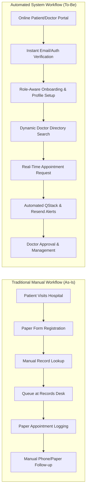
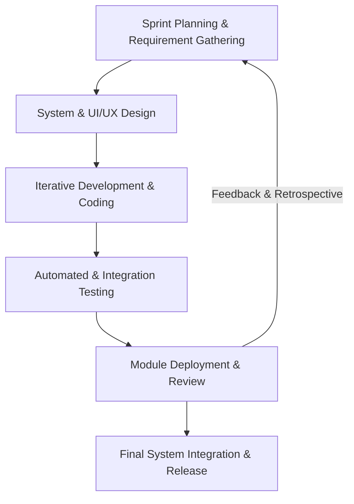
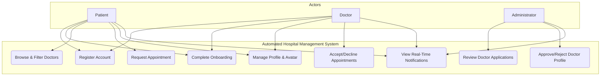
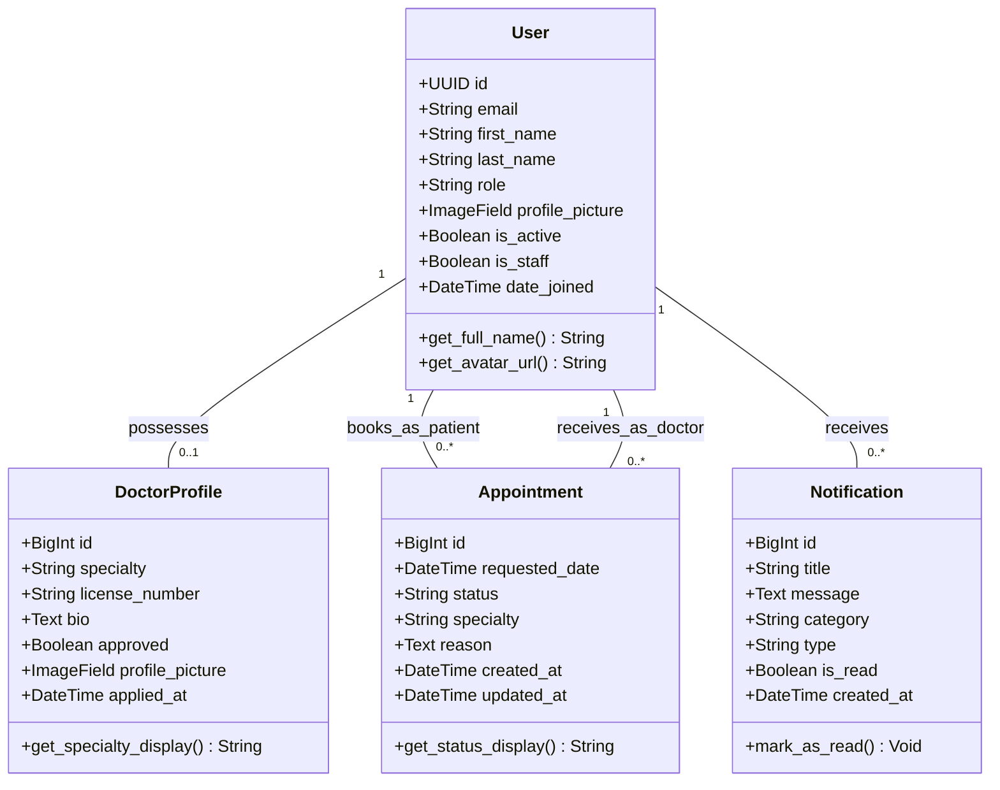
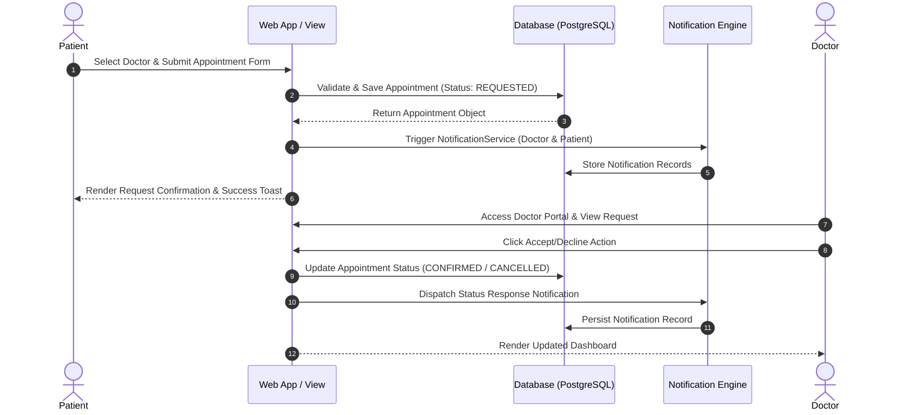
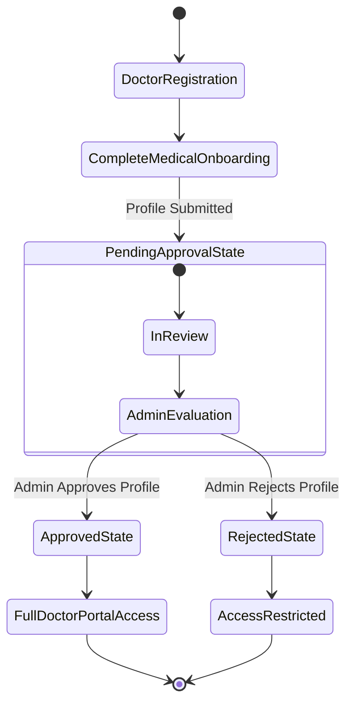
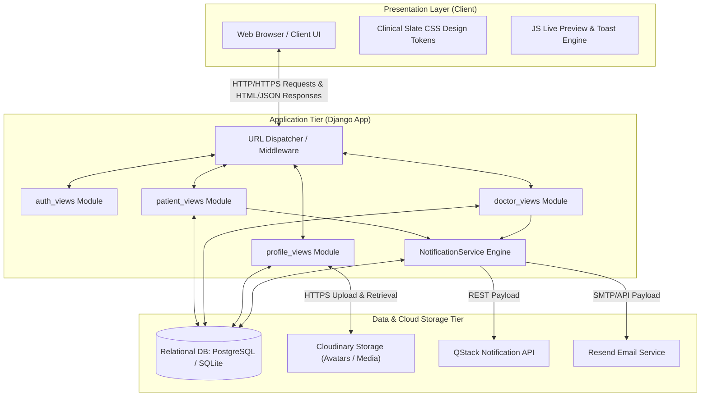
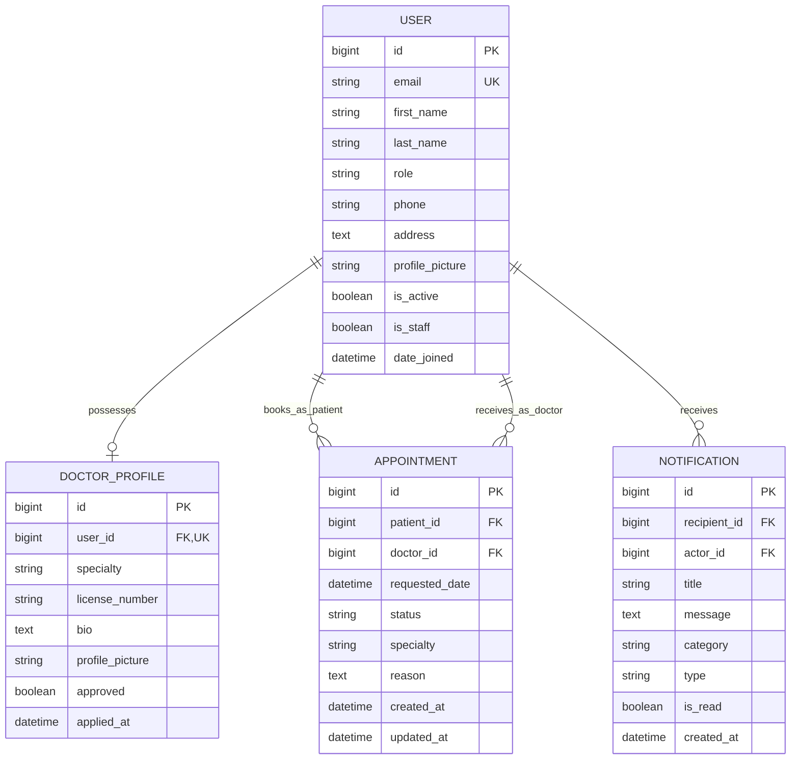

# CHAPTER 3: SYSTEM ARCHITECTURE AND DESIGN

---

## 3.1 Overview
This chapter details the design, architectural blueprint, and system design for the **Automated Hospital Management System**. It outlines the conceptual framework, adopted Software Development Life Cycle (SDLC) model, requirement engineering specifications, Unified Modeling Language (UML) diagrams, system architecture, database design, entity-relationship models, and normalization proofs.

---

## 3.2 Conceptual Framework

The conceptual framework represents the structural workflow of the solution, contrasting traditional manual hospital workflows (**As-Is State**) with the digitized, automated system (**To-Be State**).

### 3.2.1 Narrative Representation
* **As-Is Process Flow**: Patients manually visit hospital premises to queue for registration, consultation booking, and record lookup. Doctors manually update paper charts, and notifications regarding appointment approvals or reschedules are communicated manually via physical visits or phone calls, resulting in delays, lost records, and scheduling conflicts.
* **To-Be Process Flow**: A centralized web application provides immediate access. Patients register online, undergo instant profile setup, search for verified doctors by medical specialty, and submit appointment requests. Doctors review requests within a dedicated portal, approving or declining requests with automatic notification dispatches via real-time web alerts and external email endpoints. Profile media is served via cloud storage, eliminating paper charts and manual delays.

### 3.2.2 Process Flow Diagram (As-Is vs. To-Be)

---

## 3.3 Development Methodology (SDLC)

### 3.3.1 Model Selection & Rationale
The **Agile Iterative SDLC Model** was selected for this project. Given the scope, requirement updates during testing, and the need to deliver modular features (e.g., Auth, Profile Management, Appointment Lifecycle, Notification Engine), Agile enables incremental sprints, rapid prototyping, and continuous validation.

### 3.3.2 Figure 3.1: Adopted SDLC Model

### 3.3.3 SDLC Phase Discussion
1. **Requirements & Sprint Planning**: Features were decomposed into user stories (Patient onboarding, Doctor approval, Appointment scheduling, Notification triggers).
2. **Design**: Wireframing and schema definition using the Clinical Slate aesthetic and 3-tier MVC principles.
3. **Iterative Development**: Implemented iteratively in Python/Django, starting with custom user authentication, followed by role guard decorators, appointment state machines, and Cloudinary media pipelines.
4. **Testing**: Unit testing views, model constraints, URL routing, and security validation (CSRF, role permissions).
5. **Deployment & Review**: Staging release, user acceptance validation, and performance tuning.

---

## 3.4 Requirement Engineering

### 3.4.1 Requirement Gathering Techniques
* **Technique 1: Semi-Structured Interviews**: Conducted with 5 medical practitioners, 8 patients, and 2 administrative staff members to determine pain points in appointment booking and record access.
* **Technique 2: Observational Studies**: Observed patient intake queues and record retrieval procedures at a regional hospital.
* **Sample Size**: 15 participants total.
* **Rationale**: The sample provided direct insights into administrative bottlenecks, privacy expectations, and functional needs for both clinical staff and patients.

### 3.4.2 Functional Requirements

#### Category 1: User Authentication & Role Management
* **FR1**: The system shall authenticate users using email address and password credentials.
* **FR2**: The system shall enforce role-based access control (RBAC) separating `PATIENT`, `DOCTOR`, and `ADMIN` permissions.
* **FR3**: The system shall provide automated session management and secure password hashing via Django's PBKDF2/Argon2 engine.

#### Category 2: Patient Portal & Onboarding
* **FR4**: The system shall allow new patients to complete an instant onboarding profile with contact details, age, gender, and medical history.
* **FR5**: The system shall enable patients to search and filter approved medical specialists by specialty.
* **FR6**: The system shall enable patients to submit appointment requests specifying requested date, time, and clinical reason.

#### Category 3: Doctor Portal & Verification
* **FR7**: The system shall enable doctors to complete medical credential onboarding (license number, specialty, bio).
* **FR8**: The system shall restrict doctor portal functionality until hospital administration approves the doctor profile.
* **FR9**: The system shall enable doctors to review pending requests and accept or decline appointments.

#### Category 4: Notifications & Media Handling
* **FR10**: The system shall dispatch real-time status notifications for account registration, onboarding, and appointment responses via `QStack` and `Resend` APIs.
* **FR11**: The system shall enable users to upload profile avatars stored directly in cloud infrastructure (`Cloudinary`).
* **FR12**: The system shall display unread notification counts and maintain notification history per user.

### 3.4.3 Non-Functional Requirements (NFR)
* **NFR1: Performance**: Page response time shall remain under 1.5 seconds for average load requests; notification dispatch shall occur asynchronously within 3 seconds.
* **NFR2: Security**: All authenticated routes shall enforce CSRF protection, HTTPS transport encryption, role-guarded view decorators (`@patient_required`, `@doctor_required`), and sanitized inputs.
* **NFR3: Usability**: The user interface shall adhere to modern accessibility principles, utilizing high-contrast clinical palettes (Slate/Zinc/Blue), vector SVGs, responsive layout containers, and toast alerts.
* **NFR4: Reliability & Availability**: The system shall maintain 99.5% uptime with database backup configurations on Cloud PostgreSQL infrastructure.
* **NFR5: Maintainability**: The application logic shall enforce separation of concerns via modularized view packages (`auth_views`, `patient_views`, `doctor_views`, `profile_views`).

---

## 3.5 System Design (UML Diagrams)

### 3.5.1 Figure 3.4: UML Use Case Diagram

**Description**: The Use Case Diagram illustrates the functional boundary of the system and interactions across the three principal actors: Patients, Doctors, and Administrators. Patients manage profile details, search doctors, and request appointments. Doctors undergo credentials onboarding, manage appointment requests, and update medical profiles. Administrators approve doctor applications and manage platform oversight.

---

### 3.5.2 Figure 3.5: UML Class Diagram

**Description**: The UML Class Diagram defines the structural entities and domain associations within the Django ORM framework. The `User` class serves as the core identity model with custom role fields and avatar helper properties. `DoctorProfile` maintains a 1-to-1 extension relationship with doctor accounts. `Appointment` links Patients and Doctors in a dual foreign-key relationship, while `Notification` tracks real-time alerts.

---

### 3.5.3 Figure 3.6: UML Sequence Diagram (Appointment Lifecycle)

**Description**: The Sequence Diagram delineates the step-by-step execution flow for requesting and processing medical appointments. It traces interaction sequences across the Patient user interface, backend application controller logic, database layer, notification service engine, and Doctor portal response handlers.

---

### 3.5.4 Figure 3.7: UML Activity Diagram (Doctor Approval Workflow)

**Description**: The Activity Diagram represents the operational lifecycle of a medical practitioner attempting to gain system access. It ensures strict compliance with medical validation standards: doctor accounts remain gated in a pending state until administrator evaluation unlocks full clinical dashboard features.

---

## 3.6 Architectural Design

### 3.6.1 3-Tier Architectural Model
The platform is built using a **3-Tier Model-View-Template (MVT)** architecture, extending the standard Model-View-Controller (MVC) pattern for web deployment.

1. **Presentation Layer (Client Tier)**:
   - Built with semantic HTML5, Vanilla CSS (Clinical Slate Design System), and JavaScript.
   - Handles client-side avatar image previews, active sidebar navigation highlights, toast dismissals, and responsive layout scaling.
2. **Application / Business Logic Layer (Server Tier)**:
   - Implemented in **Python / Django**.
   - Contains modular view controllers (`auth_views`, `patient_views`, `doctor_views`, `profile_views`), role permission decorators (`@patient_required`, `@doctor_required`), notification dispatchers (`NotificationService`), and form validation pipelines.
3. **Data & External Services Layer (Storage & Integration Tier)**:
   - **Relational Database**: PostgreSQL / SQLite storing normalized tables.
   - **Cloud Media Storage**: `Cloudinary` storage backend managing user avatars and profile uploads via secure HTTPS URLs.
   - **Notification Engine**: `QStack` REST API & `Resend` API providing multi-channel communication dispatches.

### 3.6.2 Figure 3.3: System Architecture Diagram

---

## 3.7 Database Design & Normalization

### 3.7.1 Figure 3.8: Entity-Relationship Diagram (ERD)

---

### 3.7.2 Database Data Dictionary & Schema Definitions

#### Table 1: `app_user` (Custom Identity Table)
| Field | Data Type | Key / Constraint | Nullable | Description |
| :--- | :--- | :--- | :--- | :--- |
| `id` | `BIGINT` | Primary Key | No | Unique identity identifier |
| `email` | `VARCHAR(254)` | Unique Index | No | Primary login credential |
| `password` | `VARCHAR(128)` | Standard | No | Encrypted hash string |
| `first_name` | `VARCHAR(150)` | Standard | Yes | User given name |
| `last_name` | `VARCHAR(150)` | Standard | Yes | User surname |
| `role` | `VARCHAR(20)` | Check Constraint | No | Options: `patient`, `doctor`, `admin` |
| `phone` | `VARCHAR(20)` | Standard | Yes | Primary phone contact |
| `address` | `TEXT` | Standard | Yes | Residential address |
| `profile_picture`| `VARCHAR(255)`| Cloudinary Path | Yes | Avatar image storage URL |
| `is_active` | `BOOLEAN` | Default: `True` | No | Account status flag |
| `is_staff` | `BOOLEAN` | Default: `False`| No | Admin portal permission flag |
| `date_joined` | `TIMESTAMPTZ` | Auto Now Add | No | Timestamp of registration |

#### Table 2: `app_doctorprofile`
| Field | Data Type | Key / Constraint | Nullable | Description |
| :--- | :--- | :--- | :--- | :--- |
| `id` | `BIGINT` | Primary Key | No | Record primary key |
| `user_id` | `BIGINT` | Foreign Key (`app_user`), Unique | No | One-to-one owner reference |
| `specialty` | `VARCHAR(50)` | Standard | No | Clinical specialization code |
| `license_number`| `VARCHAR(50)` | Standard | Yes | Medical practice license number |
| `bio` | `TEXT` | Standard | Yes | Doctor profile biography |
| `profile_picture`| `VARCHAR(255)`| Cloudinary Path | Yes | Specialty profile photo |
| `approved` | `BOOLEAN` | Default: `False`| No | Hospital admin approval flag |
| `applied_at` | `TIMESTAMPTZ` | Auto Now Add | No | Submission timestamp |

#### Table 3: `app_appointment`
| Field | Data Type | Key / Constraint | Nullable | Description |
| :--- | :--- | :--- | :--- | :--- |
| `id` | `BIGINT` | Primary Key | No | Appointment ID |
| `patient_id` | `BIGINT` | Foreign Key (`app_user`)| No | Booking patient ID |
| `doctor_id` | `BIGINT` | Foreign Key (`app_user`)| No | Assigned doctor ID |
| `requested_date`| `TIMESTAMPTZ` | Standard | No | Scheduled visit date & time |
| `status` | `VARCHAR(20)` | Default: `requested`| No | Status: `requested`, `confirmed`, etc. |
| `specialty` | `VARCHAR(50)` | Standard | No | Specialty category |
| `reason` | `TEXT` | Standard | Yes | Clinical visit explanation |
| `created_at` | `TIMESTAMPTZ` | Auto Now Add | No | Booking creation timestamp |
| `updated_at` | `TIMESTAMPTZ` | Auto Now | No | Last record update timestamp |

#### Table 4: `notifications_notification`
| Field | Data Type | Key / Constraint | Nullable | Description |
| :--- | :--- | :--- | :--- | :--- |
| `id` | `BIGINT` | Primary Key | No | Notification record ID |
| `recipient_id` | `BIGINT` | Foreign Key (`app_user`)| No | Notification recipient |
| `actor_id` | `BIGINT` | Foreign Key (`app_user`)| Yes | Event initiator reference |
| `title` | `VARCHAR(255)` | Standard | No | Alert headline title |
| `message` | `TEXT` | Standard | No | Detailed notification body |
| `category` | `VARCHAR(50)` | Standard | No | Alert category identifier |
| `type` | `VARCHAR(20)` | Default: `info` | No | Notification visual type |
| `is_read` | `BOOLEAN` | Default: `False`| No | Read/unread status flag |
| `created_at` | `TIMESTAMPTZ` | Auto Now Add | No | Dispatch timestamp |

---

### 3.7.3 Database Normalization Proof (3NF)

To guarantee structural data integrity and eliminate data redundancy, the database design was systematically normalized through Third Normal Form (3NF).

#### First Normal Form (1NF) Compliance
* **Condition**: All table fields contain atomic (indivisible) values, and no repeating groups exist.
* **Proof**: Multi-valued attributes (such as user credentials, doctor bio details, and notification targets) are isolated into individual rows. Lists of appointments or notifications are maintained via distinct rows rather than serialized arrays.

#### Second Normal Form (2NF) Compliance
* **Condition**: Meets 1NF, and all non-key attributes are fully functionally dependent on the entire primary key.
* **Proof**: Every table employs a surrogate single-column Primary Key (`id`). No composite keys are present; therefore, partial key functional dependencies cannot exist. Attributes such as `license_number` depend entirely on `DOCTOR_PROFILE.id`, and `requested_date` depends strictly on `APPOINTMENT.id`.

#### Third Normal Form (3NF) Compliance
* **Condition**: Meets 2NF, and no non-key attribute is transitively dependent on another non-key attribute (elimination of transitive dependencies: $X \rightarrow Y$ and $Y \rightarrow Z$).
* **Proof**: In `app_user`, patient and doctor master metadata is stored once. Doctor-specific attributes (`specialty`, `license_number`, `approved`) are extracted to `app_doctorprofile`. Appointments reference foreign keys (`patient_id`, `doctor_id`) without duplicating patient names or doctor contact details in `app_appointment`. If a user updates their email or phone, the update occurs strictly in one row in `app_user`, eliminating update, insertion, and deletion anomalies.

---
*End of Chapter 3 Architecture and Design Documentation.*
